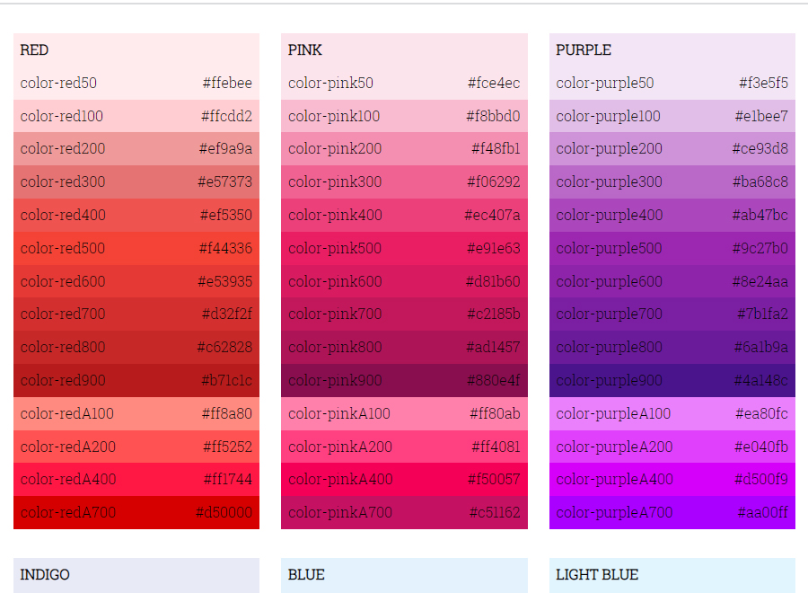

# Color Component

This is a small project I started in August 2022 and finished within the first week. I grabbed the colors from [Color Material UI](https://mui.com/material-ui/customization/color/) website.

To execute, install packages within 'package.json' one by one to avoid errors, then run 'npm run startDev' for development on your terminal.

Live Site URL: [Live Demo](https://kennyestrella-snippets-color-component.netlify.app/)

### Used tools & technologies
  